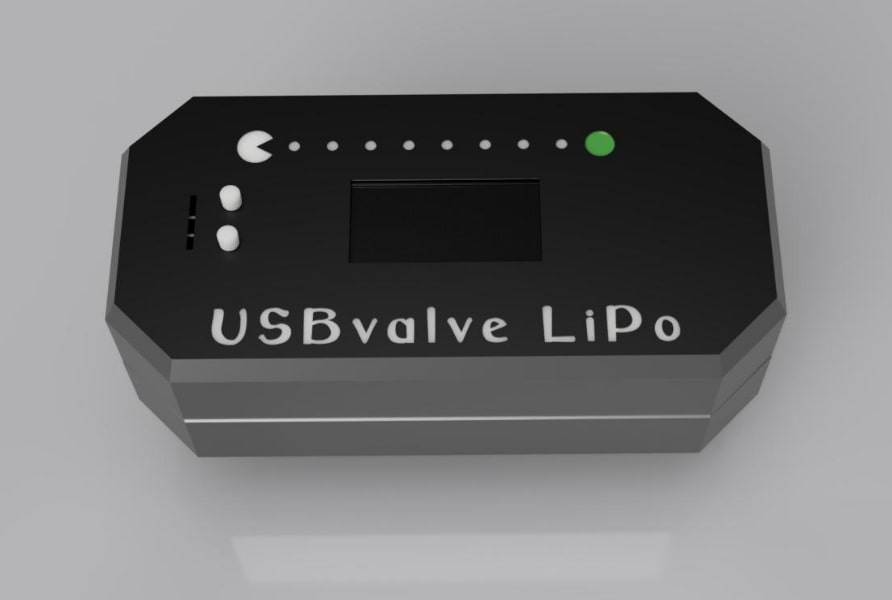
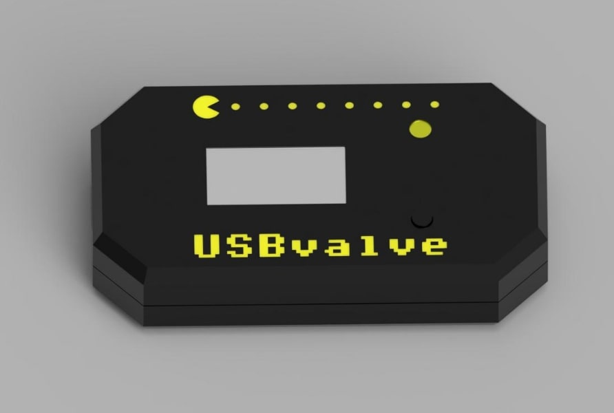
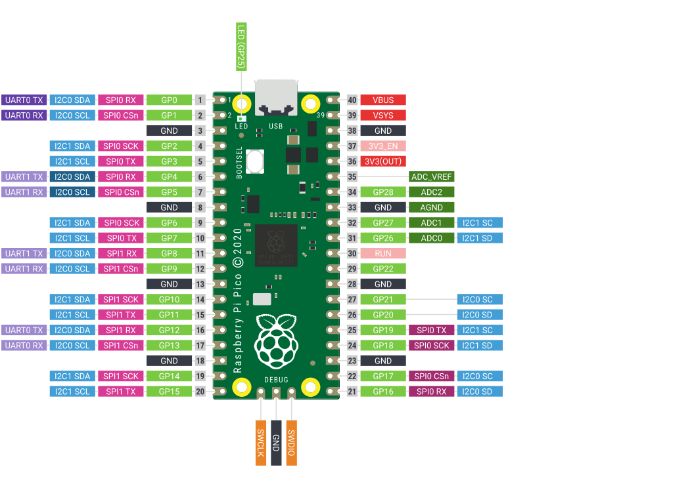
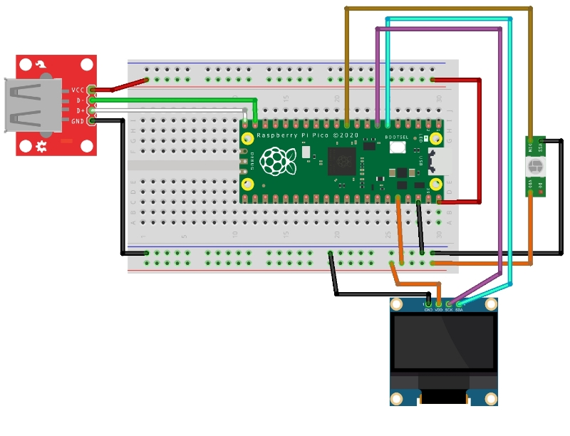
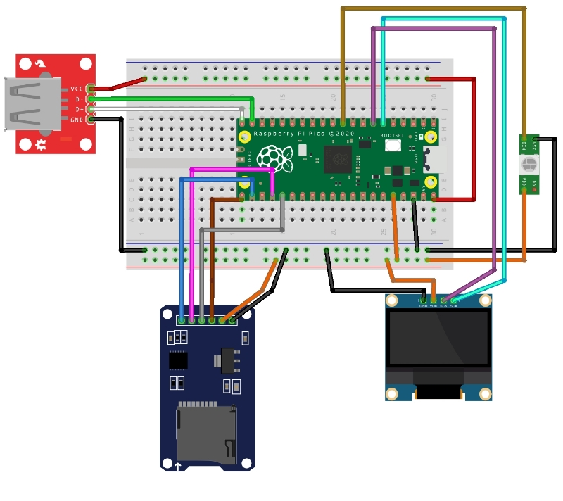

### *USBvalve TBFA Mod*

Based on [cecio/USBvalve](https://github.com/cecio/USBvalve) Version 0.18.0

[**For basic information, please visit the cecio repository.**](https://github.com/cecio/USBvalve)

<br>

I made some modifications to the USBvalve to fulfil the needs of my friends and myself.<br>
To enable **SD-Card Logging**, the entire serial output was redirected.<br>
In addition, there is the comfortable indication via a Ws2812b LED in a **Traffic Light System**.<br>
Additional you can create an independent system with a **Pimoroni Pico Lipo** and the LiPo-Mod.<br>
<br>
Compatibility with the Pi Pico Watch has been removed.

I decided against a custom PCB and used standard components.

**All required parts can be found in the corresponding BOM.**

**You can find pictures in the pictures folder.**
<br>
<br>
**Table of Contents**
* [Mods](#mods)
* [Cases](#cases)
* [Pico Pinout](#pico-pinout)
* [Mappings No Lipo](#mappings-no-lipo)
* [Mappings Pimoroni Pico LiPo](#mappings-lipo-pimoroni-pico-lipo)
* [Additional Mappings SD-Logger](#mappings-sd-logger)
* [LED meanings](#led-meanings)
* [Firmware Naming](#firmware-naming)
* [Customize Firmware](#customize-firmware)
* [Dockerfile](#dockerfile)
* [Flash Firmware](#flash-firmware)
* [Safety Warning](#safety-warning)

<br><br>

### *Mods:*
- TrafficLight LED
- simple language customisation
- Fixing the first 2 lines
- LiPo Mod
- SD-Card Logger
- PicoW LED Fix (No-WiFi Support)
  

<br><br>

### *Cases:*
STL-Files could be fond in the STL folder.

> 
> 
> **3D printable case for USBvalve LiPo (FDM ready 0.4 Nozzle)**
> <details> 
> <summary>My Settings</summary> 
>  
> **LipoValveBottom.stl & LipoValveBottom.stl**
> 
> - No supports
> - Layer height first and secound Layer 0.1 after it 0.2
> 
> **LipoValveInner.stl**
> 
> - Supports
> - Layer height 0.2
> 
> **2x LipoValveButton.stl**
> 
> - No supports
> - Raft
> - Layer height 0.2
>  
> </details>

<br>
  
>
> 
> **3D printable case for USBvalve none custom PCB (FDM ready 0.4 Nozzle)**
> <details> 
> <summary>My Settings</summary> 
>  
> - No supports
> - Layer height first and secound Layer 0.1 after it 0.2
>
> </details>

<br><br>
### *Pico Pinout:*

<br><br>

### *Mappings NO LiPo:*
> - PIN6 (GPIO4) of Pi --> OLED SDA
> - PIN7 (GPIO5) of Pi --> OLED SCL
> - PIN19 (GPIO14) of Pi --> D+ of USB Host
> - PIN20 (GPIO15) of Pi --> D- of USB Host
> - PIN23 (GND) of Pi --> GND of USB Host
> - PIN38 (GND) of Pi --> OLED GND
> - PIN36 (3V3OUT) of Pi --> OLED VCC
> - PIN40 (VBUS) of Pi --> VCC of USB Host
>   
> TrafficLight
> I use 3.3V to power the LED because 5V was too bright for me.
> Depending on the LED you may have to use 5V.
> 
> - PIN36 (3V3OUT) of Pi --> OLED VCC OR PIN40 (VBUS) of Pi --> VCC of Ws2812b DOT
> - PIN28 (GND) of Pi --> GND of Ws2812b DOT
> - PIN10 (GPIO7) of Pi --> DIN of Ws2812b DOT
>  
> Additional BOOTSEL Button form my Case Design
> - TP6 of Pi (Bottom side Testpoint) --> Pushbutton
> - PIN28 (GND) of Pi --> Pushbutton
> 

<br><br>

<br><br>

### *Mappings LiPo (Pimoroni Pico LiPo):*
> - PIN6 (GPIO4) of Pi --> OLED SDA
> - PIN7 (GPIO5) of Pi --> OLED SCL
> - PIN19 (GPIO14) of Pi --> D+ of USB Host
> - PIN20 (GPIO15) of Pi --> D- of USB Host
> - PIN38 (GND) of Pi --> OLED GND
> - PIN36 (3V3OUT) of Pi --> OLED VCC
> - PIN39 (VSYS) of Pi --> + IN DC-DC  3.7V to 5V Step-Up
> - PIN23 (GND) of Pi --> - IN DC-DC  3.7V to 5V Step-Up
> - \+ OUT DC-DC  3.7V to 5V Step-Up --> VCC of USB Host
> - \- OUT DC-DC  3.7V to 5V Step-Up --> GND of USB Host
>   
> TrafficLight
> I use 3.3V to power the LED because 5V was too bright for me.
> Depending on the LED you may have to use 5V.
> 
> - PIN36 (3V3OUT) of Pi --> OLED VCC OR PIN40 (VBUS) of Pi --> VCC of Ws2812b DOT
> - PIN28 (GND) of Pi --> GND of Ws2812b DOT
> - PIN10 (GPIO7) of Pi --> DIN of Ws2812b DOT
> 

<br><br>

### *Mappings SD-Logger:*
> SPI MicroSD Breakout Adapter
>
> - PIN21 (GPIO16) of Pi --> SD-Card Breakout MISO 
> - PIN22 (GPIO17) of Pi --> SD-Card Breakout CS
> - PIN24 (GPIO18) of Pi --> SD-Card Breakout SCK
> - PIN25 (GPIO19) of Pi --> SD-Card Breakout MOSI
> - PIN33 (GND) of Pi --> OLED GND
> - PIN36 (3V3OUT) of Pi --> OLED VCC
> 

<br><br>

<br><br>

### *LED meanings:*
- Red: Things are happening that must not happen.
- Green: Everything is OK
- Orange: Attention, something could be wrong.
- Off: Nothing connected or nothing recognised. Attention: The LED remains off with some RubberDuckies. So if a stick is connected and the LED shows nothing, it could be a RubberDucky.

<br><br>

### *Firmware Naming:*
>
>USBvalve_tbfa-x.xx.x-32NoMod = No Mods, 32Pixel Display<br>
>USBvalve_tbfa-x.xx.x-64NoMod = No Mods, 64Pixel Display
>
>USBvalve_tbfa-x.xx.x-32Tr = TrafficLight, 32Pixel Display<br>
>USBvalve_tbfa-x.xx.x-64Tr = TrafficLight, 64Pixel Display
>
>USBvalve_tbfa-x.xx.x-32SdTr = SD-Logger, TrafficLight, 32Pixel Display<br>
>USBvalve_tbfa-x.xx.x-64SdTr = SD-Logger, TrafficLight, 64Pixel Display
>
>USBvalve_tbfa-x.xx.x-32Sd = SD-Logger, 32Pixel Display<br>
>USBvalve_tbfa-x.xx.x-64Sd = SD-Logger, 64Pixel Display
>
>USBvalve_tbfa-x.xx.x-32LiSdTr = LiPo, SD-Logger, TrafficLight, 32Pixel Display<br>
>USBvalve_tbfa-x.xx.x-64LiSdTr = LiPo, SD-Logger, TrafficLight, 64Pixel Display
>
>USBvalve_tbfa-x.xx.x-32LiSd = LiPo, SD-Logger, 32Pixel Display<br>
>USBvalve_tbfa-x.xx.x-64LiSd = LiPo, SD-Logger, 64Pixel Display
>
>USBvalve_tbfa-x.xx.x-32LiTr = LiPo, TrafficLight, 32Pixel Display<br>
>USBvalve_tbfa-x.xx.x-64LiTr = LiPo, TrafficLight, 64Pixel Display
>
>USBvalve_tbfa-x.xx.x-32Li = LiPo, 32Pixel Display<br>
>USBvalve_tbfa-x.xx.x-64Li = LiPo, 32Pixel Display
>

<br><br>
### *Customize Firmware:*
You can build your own firmware.

**Uncomment one ore more defines to compile the MODS you want to use.**
```
/* 
 * #define TBFA_TRAFFIC = TrafficLight Mod
 * #define TBFA_LIPO = Pimoroni Pico LiPo Battery Mod
 * #define TBFA_SDLOG = SD-CARD Logger Mod
 * #define TBFA_ONBORDLED = Use Onbord LED on Pico
 * #define TBFA_ONBORDLEDW = Use Onbord LED on PicoW
 */

//#define TBFA_TRAFFIC
//#define TBFA_LIPO
//#define TBFA_SDLOG
//#define TBFA_ONBORDLED
//#define TBFA_ONBORDLEDW
```
<br>
To build the standard one I used:

- Arduino IDE 2.3.2
- Adafruit TinyUSB Library version 3.1.4, Pico-PIO-USB version 0.5.2, Board Raspberry Pi RP2040 (3.8.0) setting Tools=>CPU Speed at 120MHz and Tools=>USB Stack to Adafruit TinyUSB
- Adafruit_SSD1306 OLED library version 2.5.10
- ArduinoJson 7.0.4
- Adafruit NeoPixel 1.12.2
- SD by Arduino, Sparkfun 1.2.4

<br><br>

### *Dockerfile:*

If you want to build your own firmware, after you customized it, I provide a Dockerfile which builds a complete Arduino environment and compile the firmware. Enter the following commands in the main USBvalve_tbfa folder:

```
docker build -t usbvalve_tbfa/arduino-cli .
docker run --rm --name usbvalve_tbfa -v $PWD:/mnt usbvalve_tbfa/arduino-cli /mnt/USBvalve_tbfa 
```

The firmware will be placed with extension uf2 in folder USBvalve_tbfa_out.

<br><br>

### *Flash Firmware:*

To flash the firmware, follow these steps:

- Connect the Raspberry Pi Pico with the USB cable, by keeping the BOOTSEL button pressed (the big white button on the board)
- release the button
- you will see a new drive on the system, named RPI-RP2 (in Linux envs you may have to manually mount it)
- copy the proper firmware file (with extension uf2) in the folder, depending on the OLED you used
- wait few seconds until the mounted folder disappear

It's done!

<br><br>

### *SAFETY WARNING:*

> [!WARNING]
> I've received a lot of questions about **USBvalve** and *USB killer devices*. **USBvalve** is not built to test these devices, it has not any kind of insulation or protection, so if you have the suspect you are dealing with one of these devices, test it with something else, NOT with **USBvalve** or you may damage the device, yourself or objects near to you.
